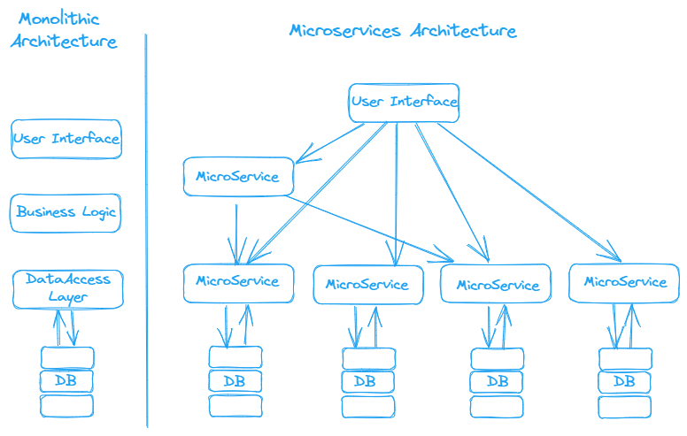

**1. Emlakcepte uygulamasına aşağıdaki isterleri ekleyin.**  
A- Ödev 2 içerisinde yaptığınız aşağıdaki methodlar için bir end-point oluşturun.

• Şehir ve ilçe bazlı ilan arama.  
• Kullanıcı yaptığı aramaları kaydedebilmeli, listeleyebilmeli.  
• Bireysel kullanıcılar sadece Konut tipinde ve en fazla 3 ilan yayınlayabilirler.  
• Şehir vitrini 10 ilandan oluşur. Şehir bazlı vitrinler oluşturun.  
• İstanbul, Ankara, İzmir şehirlerindeki ilanlarının sayısını bulun.  
• istanbul, Ankara, İzmir şehirlerindeki satılık konut ilanlarının sayısını bulun.

B- MessageService class’ı oluşturun ve CRUD işlemlerini gerçekleştiren yeni end-pointler yazın.

---
**2. Ödev 2 içerisinde yaptığınız medium web sitesinin controller katmanını yazın.**   
Request:  
````http
POST http://localhost:8080/api/users
````
Response: 200 OK  
````json
{
  "userName": "alp",
  "email": "email@gmail.com",
  "password": "password"
}
````
Request:  
````http
GET http://localhost:8080/api/users
````
Response: 200 OK  
````json
[
  {
    "userName": "alp",
    "email": "email@gmail.com",
    "password": "password",
    "articles": null,
    "followedUsers": null,
    "followedTags": null
  }
]
````
Request:  
````http
POST http://localhost:8080/api/articles
````
Response: 200 OK
````json
{
  "title": "title",
  "content": "content",
  "tags": [
    "Technology"
  ],
  "isDraft": false
}
````
Request:  
````http
GET http://localhost:8080/api/articles
````
Response: 200 OK.  
````json 
[
    {
        "title": "title",
        "content": "content",
        "tags": [
            "Technology"
        ],
        "isDraft": false,
        "user": null
    }
]
````

**3. FeignClient kütüphanesiyle gerçekleştirdiğimiz emlakcepte-banner-service senkron
iletişimi aynı zamanda Spring RestTemplate ile de gerçekleştirin.**
---
**4. Mikroservice mimarisi ve monolith mimariyi karşılaştıran bir yazı yazın.**  
**Monolith Mimari**  
Monolitik mimaride üç tane katman vardır.  
- Presentation Layer: Son kullanıcının gördüğü yani clientin gördüğü kısım.
- Business Layer: Kodların yazıldığı kısım. Mantıksal kısımlar bu bölümde kodlanır.
- Data Access Layer: Verilerin tutulduğu yer.


Avantaj;
- Modüller tek bir proje üzerinde çalışmaktadır. Bu yüzden geliştirmesi basittir. 
- Projenin test edilebilirliği ve ölçeklendirme kolaydır.
- Yatay olarak mimarinin kopyasını Load Balancer arkasında çalıştırabilirsiniz.

Dezavantaj;
- Bakımı proje büyüdükçe zorlaşır. (Sürdürülebilirlik)
- Uygulamanın boyutu başlama süresini yavaşlatır.
- Uygulama güncelleneceği zaman tüm uygulamayı tekrardan deploy etmeniz gerekir.
- Bazen Monolitik uygulamalar ölçeklendirileceği zaman sorun çıkarabilir.
- Ölçeklendirme tüm proje genelinde yapılır.
- Güvenilirlik / Sağlamlık / Dayanıklılık

Uygulamaya çok fazla istek gelmeye başladığı bir senaryo düşünelim. Artık database sorgulara yetişememeye başlar.
Load Balancer: Client üzerinden gelen istekleri duruma göre sunucular arasında paylaştırmayı sağlar.


**Mikro Services Architecture**  
SOA'nın bir yorumudur. Bu yüzden SOA'nın avantaj ve dezavantajlarınıda inceleyelim.  
SOA (Service Oriented Architecture)
Özet olarak Servislerin ayrı ayrı tasarlanıp, bir yapı oluşturmasını sağlar.
Yapılar birbirinden bağımsız olarak çalışabilirler.
Birden çok sistemin yer aldığı yapılarda kullanırlar.
Kendi içerisinde bir çok bileşeni vardır.
Dağıtım yazılım sistemlerinin kalitelerini artırmayı hedefler.

- Tekrar kullanılabilirlik
- Uyumluluk
- Bakım Yeteneği

Avantaj;  
- Servisler tekrar kullanılabilir.
- Servislerin bakım ve onarım süreçleri kolaydır.
- Güvenirlik / Dayanıklık
- Up Time oranları yüksektir. Ulaşılabilirlik
- Yatay ve Dikey ölçeklendirme mümkündür.
- Platformdan bağımsızdır.

Dezavantaj;
- Overload
- Yüksek maliyet
- Yüksek Bant genişliği(Buna uygun sunuculara sahip olmanız gerekiyor. )

Her bir servisin kendine ait bir dünyada çalışmasını hedefler. (Server Stack)  
Her servisin kendine ait bir veritabanı vardır.  
Mikroservisler küçük bağımsız, bütün sistemin fonksiyonel yapısı etrafında inşa edilmiş uygulamalardır.   
Birbirleriyle çalışmaya ihtiyaç duydukları zaman açık protokoller üzerinden (http, udp, messaging)   
birbirleriyle serbestçe iletişim kurarlar.   
Genellikle bir ya da iki kalıcı teknolojiyle (mongoDB, redis vb)
desteklendiklerinden bu teknolojiye en uygun programlama dili ile geliştirilebilirler.  
Mikroservislerin hedeflediği şey, sadece bir küçük işi çok iyi yapmaktır.  
Api GW üzerinden dış ve iç dünyaya açılırlar.  
Hepsi ayrı bir proje olduğu için herhangi bir teknoloji ve dile ait bir kısıtlama olmaz.  
Stateless yapılardır.  
Build ve deploy süreleri birbirinden bağımsız olacaiından developerlar açısından ciddi bir zaman kazancı sağlamakta.  
Ekibe yeni bir developer geldiğinde tüm sistemi değilde katkı vermesi beklenilen servisi öğrenim süresi daha kısa sürer.   
Mikroservis mimarisinde de yatay ölçeklendirme (horizontal scaling) kolay bir şekilde yapılabilir.  
Yatay ölçeklendirme yani horizontal scaling kısaca yeni bir sunucu ekleyerek kümeyi büyütme;
dikey ölçeklendirme yani vertical scaling ise mevcut sunucuların core / memory ile kapasitelerini 
büyütme demektir.   
Ölçeklendirme ihtiyacı bu mimariyi kullanıp kullanmamaya karar verirken 
en önemli ölçütlerden biridir. Bu mimariyi tercih ederken ölçeklendirmeye ne kadar
ihtiyacınız olduğu değerlendirilmelidir.

